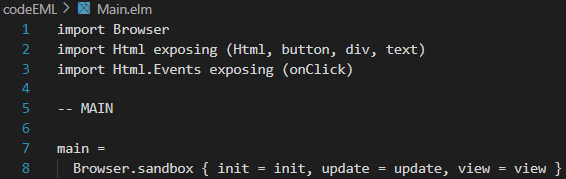
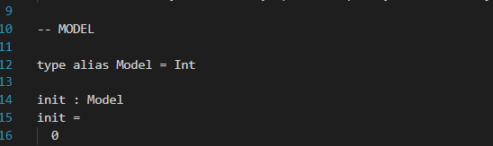
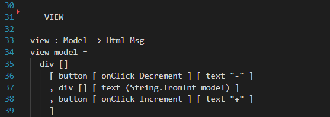

# codePourELM

Voici notre application qui présente l'architecture ELM.

## L'application

 

Notre application mplémente l'architecture ELM (Model View Update) qui permet de mettre à jour un, ou des composants d'une page HTML, en fonction du comportement de l'utilisateur. Et ce, sans avoir à recharger la page.

## Utilisation de l'application

Cette application se compose en 2 partie :  

### La première partie 

Lorsque l'utilisateur clique sur les boutons - ou +, le nombre se met à jour automatiquement en faisant une soustraction ou une addition.

### La seconde partie

L'utilisateur entre un texte et clique sur le bouton "Inverser le texte", le texte inversé s’affiche en dessous.

## Fonctionnement de l'application

 

Modèle (Model) : Il représente l'état actuel de l'application. Cela comprend les données pour afficher l'interface utilisateur, telles que les données ou les constantes. Le modèle est immuable, ce qui signifie qu’il ne peut pas être modifié directement, toutes les modifications sont effectuées par la fonction d’Actualisation (Update), ensuite le modèle mettra à jour la vue.

Vue (View) : La vue est responsable de la génération du contenu en utilisant les informations données par le modèle. Elle est une représentation purement visuelle de l’application et ne contient aucune logique métier. Dans le langage ELM, la vue produit le HTML qui sera affiché par le navigateur, il fournit une syntaxe spéciale permettant de mapper directement les valeurs du modèle vers des éléments HTML.

Mise à jour (Update) : La fonction de mise à jour est chargée de traiter les actions de l’utilisateur et de modifier le modèle en conséquence. Elle prend en entrée l’action de l’utilisateur et l’état actuel du modèle, puis renvoie un nouveau modèle mis à jour. C’est le seul moyen par lequel le modèle peut être modifié, ce qui garantit un flux de données unidirectionnel et prévisible.

### Le code ELM

Voici le code EML de la partie qui met à jour le compteur sur la page HTML en fonction des boutons + et - sur lesquels l'utilisateur à la possibilité de cliquer. 

#### La partie Main

La partie Main sert simplement de constructeur pour le navigateur.

#### La partie Model

La partie Model sert d'initialisation : 
`init : Model` initialise l'application EML et le nombre central `init = 0` est initialisé à 0. 
Le Modèle est le corps de notre application.

#### La partie Update 
La partie Update sert à calculer la nouvelle valeur, elle stocke les fonctions `Increment` et `Decrement`. La partie Update gère également la mise à jour du modèle avec le `update msg model`

#### La partie View
La partie view s'occupe de la partie graphique de l'application.  
C'est elle qui implémente les boutons et le nombre entier. Les boutons appellent les fonctions d'incrémentation de la partie Update.

 
